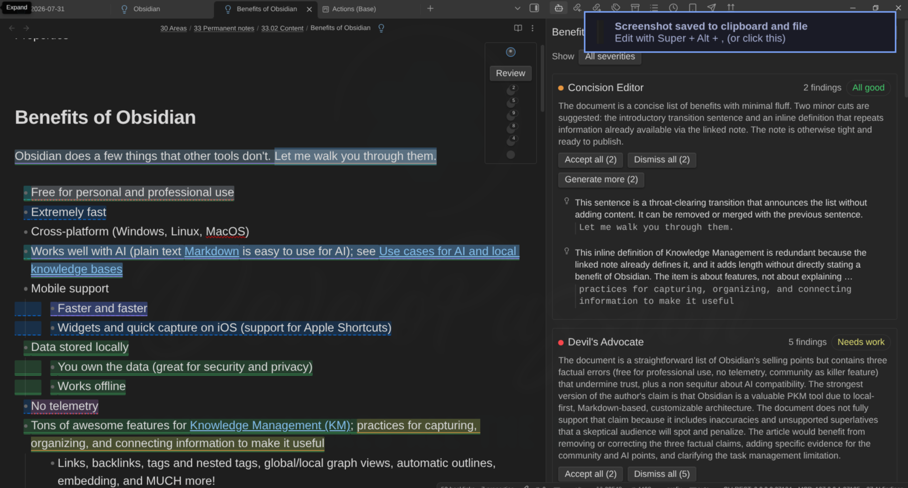
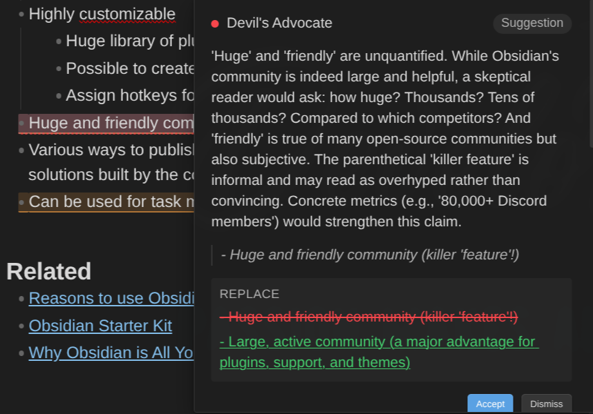

# AI Editor

An [Obsidian](https://obsidian.md) plugin that brings AI editing, reviewing, and QA **into the editor itself** — not a chat sidebar, but configurable AI personas ("Editors") and groups of them ("Panels") that highlight what they care about in your text, argue with you, and propose surgical edits you accept or reject inline.

Nothing ever runs on its own: every AI call is something you asked for, and every proposed change goes through a visible diff with **Accept** and **Reject**. There is no code path that writes AI output into a note without your confirmation.

Desktop only. Bring your own backend — a hosted API (Anthropic, OpenAI, OpenRouter and other OpenAI-compatible endpoints, Azure OpenAI, Ollama) or an agent CLI running on your own machine (Claude Code, Codex).

## What it does

You write. When you want a second opinion, you summon your editors. They read the note, come back with findings anchored to the exact words they are about, and you accept, dismiss, or argue with each one.

- **Editors** — AI personas you define with a prompt: a name, a colour, and what they care about. Six ship with the plugin (Concision Editor, Devil's Advocate, Fact Checker, Flow & Structure Editor, Humanizer, Beginner Reader) and all six are fully editable.
- **Panels** — groups of editors that review together and are then summed up in one scorecard: an overall verdict, a verdict per member, ranked top fixes, and where the members disagreed.
- **Actions** — verbs you run on a selection: rephrase, summarize, simplify, humanize, continue writing, say more, critique, find evidence, identify assumptions — plus your own custom actions.
- **Margin comments** — park a question on a passage and keep writing; an editor answers it in the background, and the answer waits for you in a column beside the text.
- **Vault as configuration** — every prompt field accepts direct text _and/or_ references to your own vault notes, resolved fresh at run time. Documenting your assistant in your vault _is_ configuring the plugin.

## Screenshots

Findings anchored in the text, each tinted in its editor's colour, with the persona rail in the corner and every editor's verdict in the side panel:

Click a highlight for the critique, the quote, and a labelled diff you accept or dismiss — or push back in the reply box:

Editors are personas you define — a name, a colour, a prompt, optionally backed by your own vault notes:

Enable as many as you want, and group them into panels that review together and produce one scorecard:

## The screens, in words

**The persona rail.** Every markdown editor gets a small card in its top-right corner: a **Review** button and one named row per enabled editor. Each row draws a ring in that editor's colour around its dot, and the ring says what it is doing — dashed while it waits its turn, a sweeping arc while it works, solid when it lands, the error colour when it fails — next to a live finding count. Hover a row for the exact state: "Concision Editor — 3 findings", "Devil's Advocate — waiting", "Fact Checker — failed (timeout)". A panel is one row with a hollow centre, its name carrying "(panel)", with its members bracketed underneath it.

**Findings in the text.** Each finding tints the exact span it quotes in its editor's colour, with a per-editor edge style underneath so the two are never told apart by colour alone. Keep typing: highlights follow your edits. Edit _inside_ a highlighted span and the finding goes stale — dashed and dimmed — because its proposal no longer matches your text.

**The review card.** Click a highlight and a card floats next to it: the critique, the quoted text, and — when the editor proposed changes — a labelled preview per edit (**Replace**, **Insert above**, **Insert below**, **Delete**: an insertion shows only what is added, so it never looks like a rewrite) with **Accept** and **Dismiss**. Accept applies the whole proposal as one undoable edit. Overlapping findings stack in one card, innermost first. Under it, a reply box: type your objection and the editor either withdraws the finding or holds its position and sharpens it.

**The AI Editor Review panel.** A side panel — its tab reads **AI Editor Review** — lists every editor's status, summary, findings and verdict for the note it is bound to, with its own **Review** button and, for panel runs, the scorecard on top. Click a finding to jump to it in the text, or step through one editor's findings with the **‹ 2 of 5 ›** control in its section header — the same stepping the **Next finding** command does, on the same cursor, with the row it points at marked in the list and your keyboard left on the arrow. Findings whose quote could not be located are grouped under "Not anchored" rather than guessed into a position.

**The margin column.** Comments sit in a column beside the text, each card aligned with the line it is about: who was asked, how long it has been running, and the answer once there is one. Several comments on one line collapse into a chip that expands.

**The status bar** shows the number of open findings for the active note, and nothing at all when there are none.

## Privacy and security

This is the part to read before installing, not after.

- **Nothing runs automatically.** Every backend request is triggered by an explicit action of yours — Review, an action verb, a push-back, a comment, a health check. The one opt-in exception is **daemon mode**: a settings toggle, off by default, that lets your editors refresh their recommendations after you pause editing. Turning it on _is_ the explicit action, and its settings copy states the cost plainly.
- **Nothing is written without a diff.** Every AI-proposed change is a structured edit previewed until you accept it, and it is only applied while the target text still matches exactly what the proposal was computed against. A proposal that fails validation is shown as critique only — never applied, never silently dropped.
- **Excluded notes are never sent anywhere.** Exclude by folder, by tag, or with `ai_editor: false` in a note's frontmatter. An excluded note is never the review target, never attached as linked context, and never followed through a wikilink from another prompt.
- **What actually leaves your vault**, for a hosted API backend: the note's text (or the selection), the persona prompt and voice profile, and any vault notes you explicitly attached — nothing else. Run **Preview what will be sent** to see the exact assembly, character counts included, before spending anything.
- **API keys live in this plugin's `data.json`, inside your vault.** If the vault syncs — Obsidian Sync, iCloud, git, Syncthing — the keys travel with it. Use minimal-scope keys and rotate them if the vault ever leaks. Keys and prompts are redacted from logs and error reports, and exported settings never contain a key.
- **Margin comments never touch your notes.** They live in one file in the plugin's own data folder, never next to a note and never in its frontmatter.

### CLI backends run a program on your computer

A CLI backend does not call a remote API: it starts a local agent with your note on its standard input. That is the highest-risk thing this plugin does, so the containment comes first.

- **No shell, ever** — the tool is started with an argument array, so there is no quoting rule to get wrong.
- **You name the exact binary** — an absolute path to an existing executable file. A bare name or a relative path is refused, because it would be resolved through `PATH` or the working directory.
- **Your note never appears in the arguments** — standard input only. Arguments are world-readable on a shared machine; notes are not.
- **A throwaway working directory**, created per run and deleted when it ends. Never your vault, and deliberately not the plugin's own folder either — that lives inside the vault and syncs.
- **An environment built from empty** — a home directory, a `PATH`, a locale, and a temporary directory pointing inside the throwaway folder. Nothing else in Obsidian's environment travels with the request, and no setting can add to the list.
- **No session on disk** — both tools run with session persistence off, so a review does not leave a resumable transcript of your note.
- **Every run ends with the whole process tree killed**, verified rather than assumed, including runs that finished normally. A run whose tree could not be killed is reported as failed, not passed off as a success.

**What the plugin does not bound**, stated plainly because you are being asked to allow a program to run: each tool's own configuration is loaded — for Claude Code that means your `CLAUDE.md`, skills, plugins, hooks and `settings.json`, including permission rules you wrote there; for Codex it means `~/.codex/config.toml`, and any MCP servers declared in it. Suppressing those would break authentication or silently change which model answers. Codex runs under `--sandbox read-only`; Claude Code has no sandbox flag to run under.

On top of that, **two separate consents**, both revocable, both recording _which executable_ they were granted for — so a changed, imported or synced path invalidates the earlier agreement and you are asked again about the program that is actually there. Full detail: [CLI backends](docs/cli-backends.md).

## Installation

Requires Obsidian **1.8.7** or newer, on **desktop** (Windows, macOS, Linux). The `editor-ai-daemons:*` command-line integration additionally needs Obsidian 1.12.2.

### Community plugins

Once the plugin is available in the community catalog:

1. In Obsidian, go to **Settings → Community plugins**.
2. Disable **Restricted mode** if it is enabled.
3. Select **Browse**, search for **AI Editor**, install it, then enable it.

### Manual installation

1. Download `main.js`, `manifest.json` and `styles.css` from the [latest release](https://github.com/dsebastien/obsidian-ai-editor/releases).
2. Copy them into `<Vault>/.obsidian/plugins/editor-ai-daemons/`.
3. Reload Obsidian and enable **AI Editor** in **Settings → Community plugins**.

### BRAT (bleeding edge)

[BRAT](https://github.com/TfTHacker/obsidian42-brat) installs plugins straight from a GitHub repository and keeps them updated. Use this if you want the latest commits — **things might break**.

1. Install **Obsidian42 - BRAT** from **Settings → Community plugins → Browse** and enable it.
2. Run **BRAT: Add a beta plugin for testing** from the command palette.
3. Paste `https://github.com/dsebastien/obsidian-ai-editor`.
4. Enable **AI Editor** in **Settings → Community plugins**.

## Quick start

The **setup wizard** opens by itself the first time the plugin loads and walks you through everything. Nothing is saved until the last step, so you can leave at any point without changing a thing, and you can re-run it whenever you like from **Settings → AI Editor → Behavior → Setup** or the **Run setup wizard** command.

1. **Add a backend** — pick a provider, paste a key, name a model. Select **Test connection**: it sends one small real request through the same path a review takes, so a green light means reviews will actually work.
2. **Choose your editors** — six are seeded and enabled; turn off the ones you do not want paying for.
3. **Point at your voice profile** (optional) — a vault note describing how you write, injected into every editor's prompt.
4. **Decide when editors run** — summoned only (the default), or daemon mode.
5. Open a note and run **Review current note**.

Prefer doing it by hand? **Settings → AI Editor → Backends → Add backend**, set it as the global default, make sure at least one editor is enabled, then run **Review current note**.

## Documentation

Full user guide: **<https://dsebastien.github.io/obsidian-ai-editor/>**

- [Install and quick start](docs/install.md)
- [Set up a backend](docs/backends.md) — providers, models, thinking modes, timeouts
- [Review a note](docs/usage.md) — the rail, findings, cards, triage, bulk operations
- [Create and tune editors](docs/editors.md) — personas, prompts, context, voice profile
- [Run actions on a selection](docs/actions.md) — built-in verbs and custom actions
- [Work with panels](docs/panels.md) — charters, scorecards, partial failures
- [Margin comments](docs/margin-comments.md) — parked questions answered in the background
- [Binding rules](docs/rules.md) — per-folder, per-tag, per-note-type routing and kill switches
- [Daemon mode](docs/daemon-mode.md)
- [CLI backends](docs/cli-backends.md) — Claude Code and Codex, and their security model
- [The command line](docs/command-line.md) — `editor-ai-daemons:review`, `editor-ai-daemons:status`, `editor-ai-daemons:cancel`
- [Move settings between vaults](docs/transfer.md)
- [Privacy and security](docs/privacy-and-security.md)
- [Configuration reference](docs/configuration.md) — every setting, its default, what it does
- [Tips and best practices](docs/tips.md)
- [Troubleshooting](docs/troubleshooting.md)

## Inspiration

This plugin stands on the shoulders of two people:

- **[Maggie Appleton](https://maggieappleton.com)** — her [Language Model Sketchbook, or Why I Hate Chatbots](https://maggieappleton.com/lm-sketchbook) introduced _daemons_: background characters with distinct epistemic roles that live in the margins of your writing environment, suggest rather than impose, and can always be ignored. The core interaction philosophy of this plugin — bring the language model to the editing and thinking process instead of exiting into a chat interface — is hers.
- **[Juri Strumpflohner](https://juri.dev)** — his AI-first markdown writing editor demos showed what that philosophy looks like as a working tool: a persona rail, summoning reviewers, inline diff suggestions, push-back conversations, and async review comments:
    - [Built an AI-first markdown writing editor…](https://x.com/juristr/status/2074494746484236459)
    - [I'm starting to really like this flow of collaborative editing](https://x.com/juristr/status/2077036970895872368)
    - [I love my little reviewing tool…](https://x.com/juristr/status/2079297727364464700)

## Development

Built with [Bun](https://bun.sh/) and TypeScript, from the [Obsidian Plugin Template (Bun)](https://github.com/dsebastien/obsidian-plugin-template).

### Prerequisites

- [Bun](https://bun.sh/) (latest version)
- [Git](https://git-scm.com/)
- An Obsidian vault for testing (`OBSIDIAN_VAULT_LOCATION` env var)

### Commands

| Command             | Description                       |
| ------------------- | --------------------------------- |
| `bun install`       | Install dependencies              |
| `bun run dev`       | Development build with watch mode |
| `bun run build`     | Production build                  |
| `bun run tsc:watch` | Type check in watch mode          |
| `bun run lint`      | Run ESLint                        |
| `bun run format`    | Format with Prettier              |
| `bun test`          | Run tests                         |
| `bun run validate`  | Type check, lint and test         |

## Contributing

See [CONTRIBUTING.md](./CONTRIBUTING.md) for contribution guidelines.

## License

MIT License - see [LICENSE](./LICENSE) for details.

<!-- other-plugins:start -->

## My other Obsidian plugins

| Plugin                                                                                                        | What it does                                                                                                                                  |
| ------------------------------------------------------------------------------------------------------------- | --------------------------------------------------------------------------------------------------------------------------------------------- |
| [Agentic Resource Discovery Server](https://github.com/dsebastien/obsidian-agentic-resource-discovery-server) | Local-first Agentic Resource Discovery publisher and registry that serves your AI skills and tools to agents over a local HTTP and MCP server |
| [Book Exporter](https://github.com/dsebastien/obsidian-book-exporter)                                         | Export books (one manifest note + linked chapter notes) to EPUB and PDF via Pandoc                                                            |
| [Bookshelf Base](https://github.com/dsebastien/obsidian-bookshelf)                                            | Display your notes as a visual bookshelf via a custom Bases view                                                                              |
| [Dataview Serializer](https://github.com/dsebastien/obsidian-dataview-serializer)                             | Serialize Dataview queries to Markdown, and keep the Markdown representation up to date                                                       |
| [Expander](https://github.com/dsebastien/obsidian-expander)                                                   | Replace variables across your vault using HTML comment markers. Supports static values and dynamic functions                                  |
| [Ghost Publish](https://github.com/dsebastien/obsidian-ghost-publish)                                         | Publish your vault notes to a Ghost blog with configurable presets for tags, newsletters, and frontmatter conventions                         |
| [Graph Explorer Base View](https://github.com/dsebastien/obsidian-graph-explorer-base-view)                   | A custom Bases view that renders notes as an interactive force-directed graph with explored/unexplored tracking                               |
| [Hidden Folders Access](https://github.com/dsebastien/obsidian-hidden-folders-access)                         | Index hidden root-level folders (e.g. .claude) so they appear in the file tree, metadata cache, and Bases                                     |
| [Journal Bases](https://github.com/dsebastien/obsidian-journal-base)                                          | Custom Base views for journaling and periodic reviews                                                                                         |
| [Kanban Action Planner](https://github.com/dsebastien/obsidian-kanban-action-planner)                         | Render your notes as configurable Kanban boards and calendars inside Bases, with statuses, ordering, relationships, and scheduling            |
| [Life Tracker](https://github.com/dsebastien/obsidian-life-tracker-base-view)                                 | Capture and visualize the data that matters in your life                                                                                      |
| [Note Village](https://github.com/dsebastien/obsidian-note-village)                                           | A 2D pixel art village where your notes become villagers you can explore and chat with using AI                                               |
| [Obsidian Starter Kit](https://github.com/DeveloPassion/obsidian-starter-kit-plugin)                          | Adds strong typing support and powerful automation support for notes                                                                          |
| [Remarkable Synchronizer](https://github.com/dsebastien/obsidian-remarkable-sync)                             | Connect to the reMarkable cloud, list, download, and sync notebook pages as images                                                            |
| [Replicate](https://github.com/dsebastien/obsidian-replicate)                                                 | Use AI models with ease via the Replicate.com integration                                                                                     |
| [REST and MCP server](https://github.com/dsebastien/obsidian-cli-rest)                                        | Exposes CLI commands as RESTful API endpoints and an MCP server for AI tool integration                                                       |
| [Time Machine](https://github.com/dsebastien/obsidian-time-machine)                                           | Browse, compare, and restore previous versions of your notes using built-in file-recovery snapshots                                           |
| [Transcriber](https://github.com/dsebastien/obsidian-transcriber)                                             | Transcribe images to markdown using Ollama vision models                                                                                      |
| [Typefully](https://github.com/dsebastien/obsidian-typefully)                                                 | Publish social media posts with ease using the Typefully integration                                                                          |
| [Update Time](https://github.com/dsebastien/obsidian-update-time)                                             | Automatically update front matter to include creation and last update times                                                                   |

Everything I build is documented in [my newsletter](https://dsebastien.net/newsletter) and on [my YouTube channel](https://youtube.com/@dsebastien).

<!-- other-plugins:end -->

<!-- support-cta -->

## News & support

To stay up to date about this plugin, Obsidian in general, Personal Knowledge Management and note-taking:

- Subscribe to [my newsletter](https://dsebastien.net/newsletter)
- Subscribe to [my YouTube channel](https://youtube.com/@dsebastien)
- Join the [Knowii community](https://www.store.dsebastien.net/product/knowii-community/) and learn to organize your notes and put your knowledge to work, together with fellow knowledge workers

If this plugin is useful to you, here are the best ways to support my work ❤️:

- [Join the Knowii community](https://www.store.dsebastien.net/product/knowii-community/)
- [Become a GitHub Sponsor](https://github.com/sponsors/dsebastien)
- [Buy me a coffee](https://www.buymeacoffee.com/dsebastien)
- [Subscribe to my YouTube channel](https://youtube.com/@dsebastien)
- [Check out my products](https://store.dsebastien.net)

Found a bug or have an idea? [Open an issue](https://github.com/dsebastien/obsidian-ai-editor/issues).
