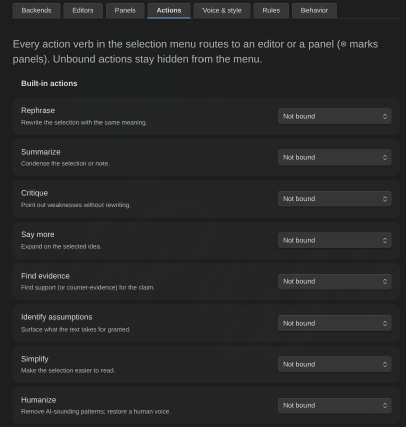

# Run actions on a selection

An **action** is a verb you run on selected text. Nine ship with the plugin, and you can add your own.

Each action is bound to one editor (or, for review-class actions, a panel) in **Settings → AI Editor → Actions**. The starter pack binds sensible defaults, so the selection menu works out of the box.

## The built-in verbs

| Verb                     | What happens to the answer | Seeded binding   |
| ------------------------ | -------------------------- | ---------------- |
| **Rephrase**             | Replaces the selection     | Concision Editor |
| **Summarize**            | Replaces the selection     | Concision Editor |
| **Simplify**             | Replaces the selection     | Concision Editor |
| **Humanize**             | Replaces the selection     | Humanizer        |
| **Continue writing**     | Inserted at the cursor     | unbound          |
| **Say more**             | Inserted at the cursor     | unbound          |
| **Critique**             | Comes back as findings     | Devil's Advocate |
| **Find evidence**        | Comes back as findings     | Fact Checker     |
| **Identify assumptions** | Comes back as findings     | Devil's Advocate |

**Continue writing** and **Say more** are deliberately left unbound: no seeded persona is an authorial voice, so any default would be a bad one. Bind them to an editor whose prompt describes _your_ writing.

## Running one

- **Right-click a selection**: the bound actions appear at the top of the context menu, with **Review selection**, **Ask for comments…** and **Ask a question…** underneath.
- **Command palette**: every bound action is also a command (for example "Humanize"), so you can assign it a hotkey in **Settings → Hotkeys**. Commands appear and disappear as you change bindings — no reload needed — and hotkeys survive renames, because command ids are stable.

An action bound to a panel says so in both places: _"Critique (panel: Pre-publish review)"_. One press there is one request per member.

## What each class does

**Rewrite verbs** (rephrase, summarize, simplify, humanize) never touch your text directly. The proposal appears as an inline diff below the selection — old text struck through, new text underlined — with **Accept** and **Reject**. While the widget has focus, Enter accepts and Escape rejects.

Accept is a single undo step, and only applies while the selected text is unchanged; editing that text dismisses the proposal as stale rather than applying it somewhere it no longer fits.

**Generate verbs** (continue writing, say more) insert a proposed continuation after the selection or at the cursor, through the same preview and the same Accept/Reject.

**Review verbs** (critique, find evidence, identify assumptions) run the ordinary review pipeline: findings arrive as highlights, exactly like **Review selection**, and are triaged the same way. These three can also be bound to a **panel**, in which case the whole panel convenes — every member runs the action with the charter in its prompt — and you get a [scorecard](panels.md) on top.

## Custom actions

**Settings → AI Editor → Actions → Add custom action** gives you your own verb.

1. **Name** — what appears in the menu and the palette.
2. **Instruction** — typed, and/or vault notes appended to it, with **Follow links** if those notes link out to more.
3. **Target** — the editor that answers, or a panel for report-findings actions.
4. **What it does** — the important one:
    - **Rewrite the selection** — the answer replaces the selected text, through the same inline diff as rephrase.
    - **Write more at the cursor** — the answer is inserted after the selection or at the cursor.
    - **Report findings** — the answer arrives as highlights on the note. Only this kind can be bound to a panel.

**There is no default for that last choice, on purpose.** The same instruction means very different things depending on it, and an action that quietly rewrote text you only asked it to check would be the worst kind of surprise. Until you pick one — and until the action has a name and an instruction — it stays out of the menu and the palette, and its row says exactly why.

Changing a bound action away from report-findings clears a panel binding the new class cannot use.

A custom action's referenced vault notes are inlined into its instruction (up to 10000 characters) at dispatch time, so an instruction can be a living note like every other prompt source.

## When an action does not appear

- The note is [excluded](privacy-and-security.md) or a [rule](rules.md) switched the plugin off for it — nothing is offered at all.
- The action is unbound — unbound actions are hidden rather than shown broken.
- The action is bound but cannot run (its editor is disabled, its backend is gone, the rewrite capability is off, the class was never chosen). The Actions tab shows the reason under its row.

## See what an action would send

**Preview what will be sent** has an **Action** picker: choose one and the preview shows what _that_ dispatch sends, including everything the action's instruction adds. Review-class instructions are appended to the system prompt; rewrite and generate instructions travel in the request payload, and the preview reports them separately with their size. An action that no longer resolves is reported as a refusal, because that is what the dispatch would do.

## Next

- [Work with panels](panels.md)
- [Create and tune editors](editors.md)
- [Review a note](usage.md)
