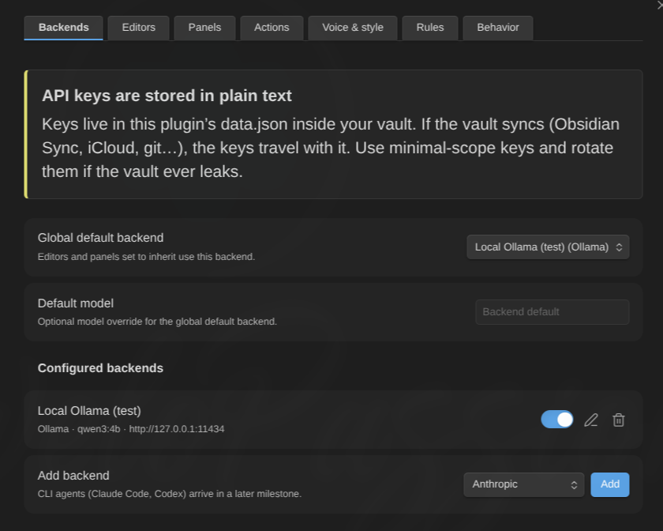

# Set up a backend

A **backend** is where the thinking happens. You can configure as many as you like and point different editors at different ones — a cheap fast model for the Concision Editor, a stronger one for the Devil's Advocate.

Everything below lives in **Settings → AI Editor → Backends**.

## Two families

- **API backends** call a hosted (or self-hosted) HTTP endpoint: Anthropic, OpenAI, OpenRouter, any OpenAI-compatible endpoint, Azure OpenAI, Ollama.
- **CLI backends** run an agent installed on your own machine: Claude Code, Codex. They have their own security model and their own consent flow — read [CLI backends](cli-backends.md) before enabling one.

Both families are resolved through the same code path, so anything that can run a review can run either.

## Add an API backend

1. **Settings → AI Editor → Backends → Add backend**, pick the provider, select **Add**.
2. Fill in the fields the provider needs (below).
3. Select **Add backend** to save.
4. Set it as the **Global default backend** at the top of the page — editors inherit it unless they override it — or assign it per editor.

### Fields, by provider

| Field                        | Shown for                        | Needed by                                                    |
| ---------------------------- | -------------------------------- | ------------------------------------------------------------ |
| **Label**                    | all                              | all — it is how you pick the backend elsewhere               |
| **API key**                  | all                              | all except Ollama                                            |
| **Base URL**                 | all                              | OpenAI-compatible, Azure OpenAI; optional override elsewhere |
| **Deployment**               | Azure OpenAI                     | Azure OpenAI                                                 |
| **API version**              | Azure OpenAI                     | Azure OpenAI                                                 |
| **Default model**            | all                              | all, unless every editor overrides it                        |
| **Thinking**                 | Anthropic, Ollama                | —                                                            |
| **Thinking budget (tokens)** | Anthropic, legacy mode only      | —                                                            |
| **Reasoning effort**         | OpenAI, Azure OpenAI, OpenRouter | —                                                            |
| **Extra request body**       | OpenAI-compatible, OpenRouter    | —                                                            |

Default base URLs when you leave the field empty: `https://api.anthropic.com` (Anthropic), `https://api.openai.com/v1` (OpenAI), `https://openrouter.ai/api/v1` (OpenRouter), `http://127.0.0.1:11434` (Ollama). OpenAI-compatible and Azure OpenAI have no default — that is the whole point of those kinds.

Saving refuses the problems it can be certain about, in the provider's own terms: _"OpenAI-compatible backends need a base URL"_, _"OpenRouter backends need an API key"_, _"Azure OpenAI backends need a deployment name"_. The rest is caught when a request is actually built, which is what **Test connection** is for — an Azure backend saved without its base URL, API version or key saves happily and fails the test.

### Provider notes

- **Anthropic** — direct browser calls, no proxy needed.
- **OpenAI** — standard Chat Completions.
- **OpenRouter** — a dedicated entry rather than "just an OpenAI-compatible endpoint": the base URL is preset, attribution headers are sent, and reasoning is passed through in OpenRouter's own parameter. Paste a key and go.
- **OpenAI-compatible** — anything speaking Chat Completions: LM Studio, Groq, vLLM, llama.cpp servers, a corporate gateway. Give it the base URL and, if it wants one, a key.
- **Azure OpenAI** — addresses a _deployment_, not a model. It needs all four of base URL, **Deployment**, **API version** and key; only the deployment is enforced when you save, so run **Test connection** before relying on it.
- **Ollama** — local, no key. If it refuses browser requests, see [Troubleshooting](troubleshooting.md#requests-fail-immediately-network-error-or-failed-to-fetch).

## Models

A model is resolved in this order: the **editor's model override** → the **backend's default model** → for CLI backends, the tool's own default. If nothing supplies one for an API backend, the editor is skipped with _"no model configured"_ rather than failing halfway through a run.

There is no model list to pick from: model ids change weekly and a stale dropdown is worse than a text field. Paste the id your provider documents.

## Thinking and reasoning modes

Both default to **off** everywhere, deliberately: a model that reasons silently for minutes with no visible output is indistinguishable from a hang.

**Thinking** (Anthropic, Ollama):

- **Off** — no extended thinking.
- **On** — Anthropic: adaptive thinking, the current API mode (Claude 4.6 and newer). Ollama: `think: true`.
- **Budget (legacy)** — Anthropic only: the manual thinking block with an explicit token budget. Only models up to Claude 4.5 accept it; **current models reject it with HTTP 400**. Use it only if you are pinned to an older model.

**Thinking budget (tokens)** appears only in legacy mode. Minimum 1024, maximum 32000, default 8192.

**Reasoning effort** (OpenAI, Azure OpenAI, OpenRouter): `default` (send nothing) / `minimal` / `low` / `medium` / `high`.

Turning either on makes runs slower. If you enable thinking on a local model, raise **Request timeout** at the same time — see [Troubleshooting](troubleshooting.md#a-review-times-out).

## Extra request body (advanced)

For OpenAI-compatible and OpenRouter backends only. A raw JSON **object** merged into the request body — provider routing preferences, host-specific flags, whatever your endpoint documents. It is validated as a JSON object when you save (`{"think": true}`, not `[…]` and not a bare value) and re-validated before the request is built.

Anything you put here is sent with every request from that backend. It can hold a credential, which is why exporting settings _declares_ a non-empty extra body instead of pretending the export is safe to share.

## Test connection

Every backend dialog has a **Test connection** button. It runs one small real operation through the exact executor a review uses — same adapter, same timeout logic, same result validation — so a pass means reviews will work, not merely that the endpoint answers.

| Outcome                     | What it means                                                                                                                    |
| --------------------------- | -------------------------------------------------------------------------------------------------------------------------------- |
| **Connection works**        | Nothing left to do.                                                                                                              |
| **Reached, but not usable** | The endpoint answered but the model ignored the required structure. A model problem, not a connection one. Try a stronger model. |
| **Failed**                  | Credentials, network, timeout or configuration. The message says which.                                                          |

The check uses its own 60-second timeout rather than your configured request timeout. A local model still loading its weights can fail here and work fine for a real review; the message says so when that is what happened.

For a CLI backend, **Test connection** asks for launch consent first — running the test _is_ launching the program.

## Streaming

Structured, buffered output is the baseline. Anthropic and the OpenAI-family kinds (OpenAI, OpenRouter, OpenAI-compatible) are executed as SSE streams where the transport allows it, which is what keeps the rail's progress alive during a long answer. Azure OpenAI and Ollama run buffered.

Either way, **an editor's findings appear when that editor finishes**, not one at a time — incremental finding extraction is deliberately out of scope. What you see arriving progressively during a multi-editor review is the editors finishing at different times.

## Timeouts, concurrency, budget

These are global and live in **Settings → AI Editor → Behavior**, not on the backend:

- **Request timeout (seconds)** — how long one editor's API request may take, connection to last byte. Default **600** (10 minutes), range 30–3600. Slow local models legitimately need minutes.
- **Max concurrent requests** — how many backend requests run in parallel across the whole plugin. Default **3**, range 1–10.
- **Context budget (characters)** — total budget per run. Default **200000**, range 1000–2000000.

A CLI backend ignores the request timeout and carries its **own** timeout instead (default 300 seconds), because an agent that goes exploring works on a different scale.

## Deleting a backend

Deleting shows you what points at it before it happens — editors, panels, the global default — and resets those references to "inherit" rather than leaving them dangling.

## Next

- [Create and tune editors](editors.md)
- [Review a note](usage.md)
- [CLI backends](cli-backends.md)
- [Configuration reference](configuration.md)
