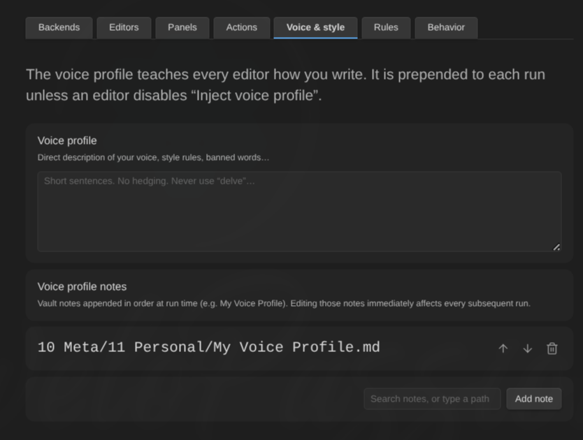

# Configuration reference

Every setting, where it lives, and what it defaults to. Settings are stored in this plugin's `data.json` inside your vault — see [Privacy and security](privacy-and-security.md#where-api-keys-live).

**Settings → AI Editor** has seven tabs: **Backends**, **Editors**, **Panels**, **Actions**, **Voice & style**, **Rules**, **Behavior**.

## Behavior tab

### Setup

| Setting          | Type   | Default | What it does                                                     |
| ---------------- | ------ | ------- | ---------------------------------------------------------------- |
| **Setup wizard** | button | —       | Re-opens the guided setup. Nothing is saved until the last step. |

### Runs

| Setting                            | Type | Default  | Range        | What it does                                                          |
| ---------------------------------- | ---- | -------- | ------------ | --------------------------------------------------------------------- |
| **Size warning threshold (words)** | int  | `8000`   | 100–1000000  | Reviews of notes above this word count ask for confirmation first     |
| **Max concurrent requests**        | int  | `3`      | 1–10         | How many backend requests may run in parallel, plugin-wide            |
| **Request timeout (seconds)**      | int  | `600`    | 30–3600      | How long one API editor request may run. CLI backends carry their own |
| **Context budget (characters)**    | int  | `200000` | 1000–2000000 | Total budget per run across system prompt, note and attachments       |

### Daemon

| Setting                                 | Type   | Default | Range | What it does                                                                                                                                                                                       |
| --------------------------------------- | ------ | ------- | ----- | -------------------------------------------------------------------------------------------------------------------------------------------------------------------------------------------------- |
| **Enable automatically for every note** | toggle | `off`   | —     | Daemon mode is per note and starts off for each note you open; this makes every note start with it already on. The per-note rail toggle still works either way — see [Daemon mode](daemon-mode.md) |
| **Idle delay (seconds)**                | int    | `3`     | 1–600 | Typing, moving the cursor or selecting text restarts the clock; triaging findings (panel or card use) does not; only an actual edit arms a refresh                                                 |

### History

| Setting             | Type   | Default | What it does                                                                                                                                         |
| ------------------- | ------ | ------- | ---------------------------------------------------------------------------------------------------------------------------------------------------- |
| **Durable history** | toggle | `off`   | Keep the History tab across sessions, per note. Stores quoted note text in the plugin folder — see [Privacy](privacy-and-security.md#review-history) |
| **Clear history**   | button | —       | Removes every history entry, in memory and on disk                                                                                                   |

### Privacy exclusions

| Setting                         | Type   | Default | What it does                                        |
| ------------------------------- | ------ | ------- | --------------------------------------------------- |
| **Excluded folders**            | list   | empty   | Notes under these folders never leave the vault     |
| **Excluded tags**               | list   | empty   | Notes carrying these tags never leave the vault     |
| **Respect frontmatter opt-out** | toggle | `on`    | Notes with `ai_editor: false` are excluded entirely |
| **Strip frontmatter**           | toggle | `off`   | Remove frontmatter from every note sent to backends |

Up to 200 folders and 200 tags.

### Responses

| Setting                        | Type     | Default | What it does                                                      |
| ------------------------------ | -------- | ------- | ----------------------------------------------------------------- |
| **Response language override** | text     | empty   | Answer in this language; empty means each note's own language     |
| **Default comment editor**     | dropdown | None    | Editor handling margin comments unless rerouted per comment       |
| **Margin comment column**      | toggle   | `on`    | Show margin comments beside the text; off keeps them in the panel |

### Import & export

| Setting             | Type   | What it does                                                   |
| ------------------- | ------ | -------------------------------------------------------------- |
| **Export settings** | button | Write the sections you pick to a vault file or the clipboard   |
| **Import settings** | button | Add entities from an exported file, after confirming a summary |

See [Move settings between vaults](transfer.md).

## Backends tab

| Setting                    | Type     | Default | What it does                                                                               |
| -------------------------- | -------- | ------- | ------------------------------------------------------------------------------------------ |
| **Global default backend** | dropdown | none    | What editors and panels use unless they override it                                        |
| **Default model**          | text     | empty   | The default backend's model, editable inline                                               |
| **Add backend**            | dropdown | —       | Anthropic, OpenAI, OpenRouter, OpenAI-compatible, Azure OpenAI, Ollama, Claude Code, Codex |

Up to 50 backends.

### API backend fields

| Field                        | Type     | Default   | Shown for                                |
| ---------------------------- | -------- | --------- | ---------------------------------------- |
| **Label**                    | text     | —         | all (required)                           |
| **API key**                  | password | empty     | all                                      |
| **Base URL**                 | text     | empty     | all                                      |
| **Deployment**               | text     | empty     | Azure OpenAI (required)                  |
| **API version**              | text     | empty     | Azure OpenAI                             |
| **Default model**            | text     | empty     | all                                      |
| **Thinking**                 | dropdown | `Off`     | Anthropic, Ollama                        |
| **Thinking budget (tokens)** | int      | `8192`    | Anthropic, legacy mode only (1024–32000) |
| **Reasoning effort**         | dropdown | `Default` | OpenAI, Azure OpenAI, OpenRouter         |
| **Extra request body**       | JSON     | empty     | OpenAI-compatible, OpenRouter            |

### CLI backend fields

| Field                      | Type    | Default     | What it does                                        |
| -------------------------- | ------- | ----------- | --------------------------------------------------- |
| **Tool**                   | fixed   | —           | Claude Code or Codex                                |
| **Label**                  | text    | —           | Required                                            |
| **Executable**             | path    | empty       | Absolute path to the binary; **Detect** fills it in |
| **Default model**          | text    | empty       | Empty means the tool's own default                  |
| **Timeout**                | int     | `300` s     | 10–3600. Separate from the API request timeout      |
| **Allowed to run**         | consent | not granted | Required before the backend runs at all             |
| **Tool and research mode** | consent | not granted | Claude Code only; Codex states why it has no toggle |
| **Test connection**        | button  | —           | One real run through the whole path                 |

See [CLI backends](cli-backends.md).

## Editors tab

Up to 200 editors. Per editor:

| Field                    | Type      | Default               |
| ------------------------ | --------- | --------------------- |
| **Name**                 | text      | —                     |
| **Color**                | swatch    | `var(--color-accent)` |
| **Persona prompt**       | textarea  | empty                 |
| **Prompt notes**         | note refs | empty                 |
| **Follow links**         | toggle    | `off`                 |
| **Backend**              | dropdown  | inherit global        |
| **Model override**       | text      | empty                 |
| **Include linked notes** | toggle    | `off`                 |
| **Linked notes cap**     | int       | `5` (1–20)            |
| **Inject voice profile** | toggle    | `on`                  |
| **Review capability**    | toggle    | `on`                  |
| **Rewrite capability**   | toggle    | `on`                  |
| **Research capability**  | toggle    | `off`                 |
| **Learning memory**      | dropdown  | `Off`                 |
| **Memory note path**     | text      | empty                 |
| **Enabled**              | toggle    | `on`                  |

**Enabled** off hides the editor everywhere (rail, highlights, panel) and keeps it out of daemon refreshes; its findings are hidden, not deleted, and return when it is re-enabled — see [Disabling an editor](editors.md#disabling-an-editor).

See [Create and tune editors](editors.md).

## Panels tab

Up to 50 panels, 1–20 members each.

| Field                          | Type                 | Default               |
| ------------------------------ | -------------------- | --------------------- |
| **Name**                       | text                 | —                     |
| **Color**                      | swatch               | `var(--color-accent)` |
| **Members**                    | toggles              | —                     |
| **Charter**                    | textarea + note refs | empty                 |
| **Aggregation backend**        | dropdown             | inherit global        |
| **Aggregation model override** | text                 | empty                 |
| **Enabled**                    | toggle               | `on`                  |

See [Work with panels](panels.md).

## Actions tab

Up to 200 bindings. Nine built-in verbs plus your own custom actions.

| Field            | Applies to     | Notes                                                                              |
| ---------------- | -------------- | ---------------------------------------------------------------------------------- |
| **Target**       | all            | An editor; a panel only for report-findings actions                                |
| **Name**         | custom actions | Required before the action appears anywhere                                        |
| **Instruction**  | custom actions | Textarea + note refs + **Follow links**; required                                  |
| **What it does** | custom actions | Rewrite the selection / Write more at the cursor / Report findings. **No default** |

See [Run actions on a selection](actions.md).

## Voice & style tab

| Field                   | Type      | Default |
| ----------------------- | --------- | ------- |
| **Voice profile**       | textarea  | empty   |
| **Voice profile notes** | note refs | empty   |
| **Follow links**        | toggle    | `on`    |

## Rules tab

Up to 200 rules, evaluated in list order with kill switches winning from anywhere.

| Field       | Type     | Values                                        |
| ----------- | -------- | --------------------------------------------- |
| **Enabled** | toggle   | `on`                                          |
| **Match**   | dropdown | Folder / Tag / Frontmatter / OSK note type    |
| **Value**   | text     | Depends on the match type                     |
| **Effect**  | dropdown | Assign reviewer / Disable plugin              |
| **Target**  | dropdown | Editor or panel, only for **Assign reviewer** |

See [Binding rules](rules.md).

## Commands

None of them ships a default hotkey. Assign your own in **Settings → Hotkeys**.

| Command                                               | What it does                                                              |
| ----------------------------------------------------- | ------------------------------------------------------------------------- |
| **Review current note**                               | Reviews the active note                                                   |
| **Review selection**                                  | Reviews the selected text                                                 |
| **Ask a question**                                    | One editor or one panel, one freeform question                            |
| **Ask for comments**                                  | Parks a margin comment on the selection                                   |
| **Preview what will be sent**                         | Read-only context preview; sends nothing                                  |
| **Open review panel**                                 | Opens **AI Editor Review** in the sidebar                                 |
| **Cancel review or action**                           | Cancels whatever is in flight for the note                                |
| **Next finding** / **Previous finding**               | Keyboard triage stepping                                                  |
| **Accept current finding**                            | Applies the replacement, moves to the next                                |
| **Dismiss current finding**                           | Clears it, moves to the next                                              |
| **Cycle severity filter**                             | All → warnings and suggestions → warnings only                            |
| **Accept all non-conflicting findings**               | Bulk accept across every editor of the note                               |
| **Dismiss all findings**                              | Bulk dismiss across every editor of the note                              |
| **Accept all from &lt;Editor&gt;**                    | One per enabled editor, generated dynamically                             |
| **Dismiss all from &lt;Editor&gt;**                   | One per enabled editor, generated dynamically                             |
| **Generate more findings from every finished editor** | One extra round per finished editor                                       |
| **Toggle the margin comment column**                  | View preference; the comments are unaffected                              |
| **Run setup wizard**                                  | Re-opens the guided setup                                                 |
| _&lt;Action name&gt;_                                 | One command per bound action, appearing and disappearing with the binding |

## Context menus

**Right-click a selection** (editor): bound actions, then **Review selection**, **Ask for comments…**, **Ask a question…**.

**Right-click a note** (file explorer): **Review note**, **Open review panel**.

## Limits

| Thing                           | Cap                         |
| ------------------------------- | --------------------------- |
| Backends                        | 50                          |
| Editors                         | 200                         |
| Panels / members per panel      | 50 / 20                     |
| Actions / rules                 | 200 / 200                   |
| Findings per backend result     | 200                         |
| Highlighted findings per note   | 2000 (all stay in the list) |
| Margin comments per note        | 500                         |
| Push-back exchanges per finding | 6                           |
| Linked notes per editor         | 20                          |
| Followed links per prompt note  | 20                          |
| CLI backend output              | 8 MB                        |
