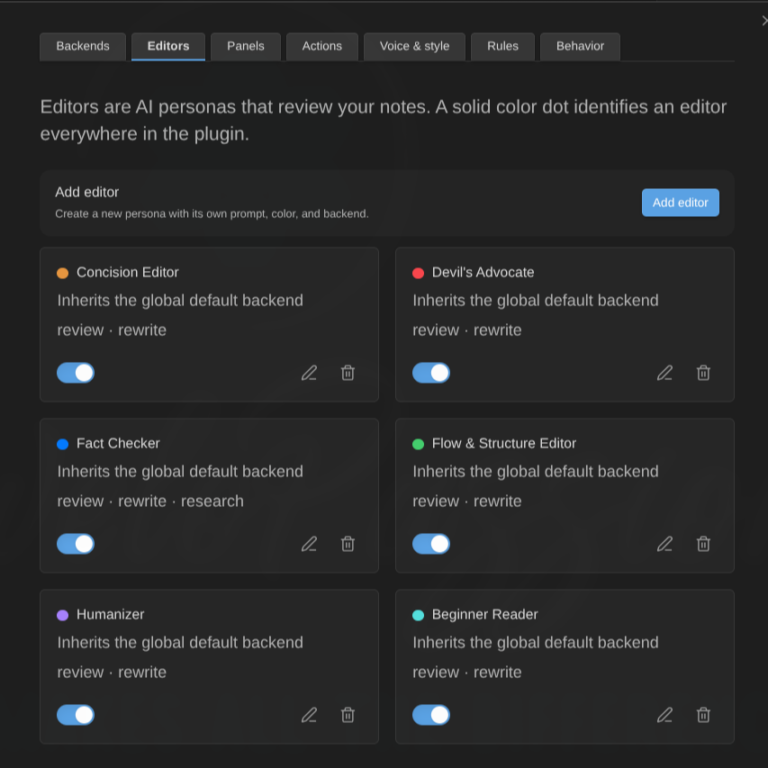
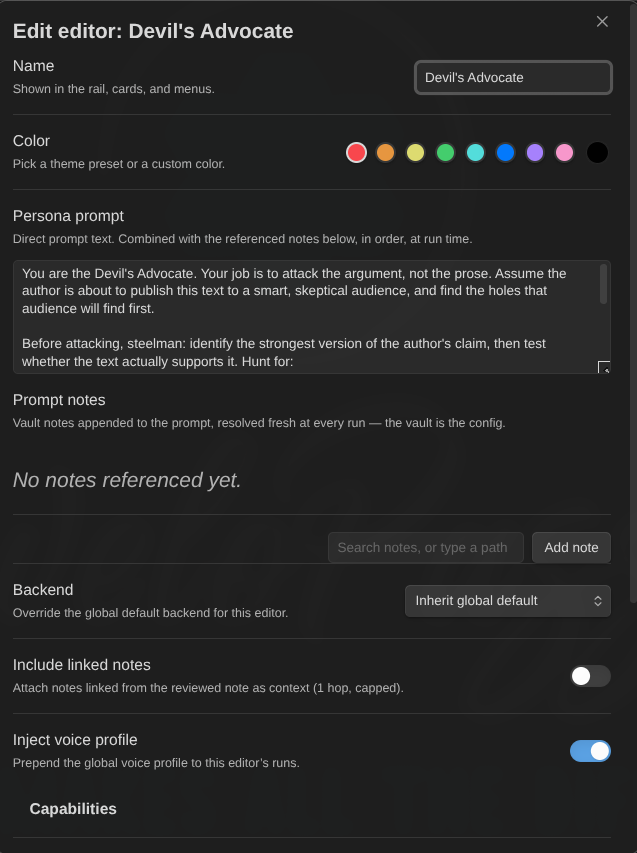

# Create and tune editors

An **editor** is an AI persona: a name, a colour, and a prompt saying what it cares about. Seven ship with the plugin and every one of them is editable, renameable and deletable — they are examples, not fixtures.

**Settings → AI Editor → Editors → Add editor**, or select an existing one to open the same dialog.

## The fields

| Field                         | What it does                                                                                 |
| ----------------------------- | -------------------------------------------------------------------------------------------- |
| **Name**                      | Shown on the rail, in cards, menus and commands                                              |
| **Color**                     | The tint of this editor's highlights, and of its dot and status ring on the rail             |
| **Persona prompt**            | Direct prompt text                                                                           |
| **Prompt notes**              | Ordered vault notes appended to the prompt, resolved fresh at every run                      |
| **Follow links**              | Also inline the notes those prompt notes link to (one hop)                                   |
| **Backend**                   | Override the global default backend for this editor                                          |
| **Model override**            | Only shown when a backend is set; empty means the backend's default model                    |
| **Include linked notes**      | Attach the notes the _reviewed_ note links to as context                                     |
| **Linked notes cap**          | 1–20, default 5                                                                              |
| **Inject voice profile**      | Prepend the global voice profile to this editor's runs (on by default)                       |
| **Capabilities**              | Review / Rewrite / Research                                                                  |
| **Learning memory**           | An extra prompt block — see [below](#learning-memory)                                        |
| **Preview what will be sent** | Assembles this editor's context for the active note, using the values you have not saved yet |

## Writing a good persona prompt

The seeded editors are worth reading as examples before writing your own. What they have in common:

- **One mandate, stated first.** "Your single mandate is economy." "Your job is to attack the argument, not the prose."
- **An explicit hunting list** — the specific things to look for, named concretely rather than as qualities.
- **Restraint rules.** When _not_ to report. Every seeded persona has them, because a persona without them reports everything and becomes noise.
- **A severity ladder** — what counts as a warning versus a suggestion versus information, in this persona's terms.
- **Second person, direct.** "You are the Fact Checker."

Findings must quote your text **verbatim**; the prompt machinery already tells the model so. What you write is the judgment, not the output format.

## The vault as configuration

Every prompt field takes direct text _and/or_ an ordered list of vault notes. The notes are read **fresh at run time**, so editing the note _is_ reconfiguring the editor — no settings round trip, no copy-paste drift. Keep your Devil's Advocate's brief in a note, revise it while you work, and the next review uses the new version.

**Follow links** adds one hop: the notes your prompt notes link to are inlined as well. Embeds count, duplicates are collapsed, and each referenced note contributes at most 20 followed links. Unresolved and non-markdown links are skipped silently. Notes excluded by your [privacy settings](privacy-and-security.md) are never attached and never followed.

Everything is subject to the **context budget** — see [what actually gets sent](#what-actually-gets-sent).

## Capabilities

Three toggles that decide what an editor is _allowed_ to be asked:

- **Review** — may critique and flag findings. Off, and the editor is skipped by reviews with the reason "review capability disabled".
- **Rewrite** — may propose replacement text. Off, and it is skipped by transform actions.
- **Research** — may look things up when the backend supports it. Only the Fact Checker has it on by default.

An editor with review off is not broken; it simply is not a reviewer. The skip is reported so you can see why it did not take part.

## Disabling an editor

The **Enabled** toggle at the bottom of the dialog benches the whole persona. The moment you switch it off, the editor vanishes from every surface: its chip leaves the rail, its highlights leave the text, its section and findings leave the review panel, and [daemon refreshes](daemon-mode.md) stop running it.

Nothing is deleted. The findings are hidden, not discarded — switch the editor back on and they return exactly as they were, no new review needed. (If a re-review of the note ran while the editor was off, that review replaced the note's results without it, so there is nothing to bring back.) Deleting an editor is different: its existing findings stay visible on the note, attributed to the name the run knew.

## Learning memory

An extra block appended to the editor's system prompt.

- **Off** (default) — nothing added.
- **Vault note** — the note at **Memory note path** is attached to this editor's runs. Readable, editable, versioned by your vault like everything else.
- **Plugin settings** — the block is stored inside the plugin's own data instead of a note.

**The plugin does not write to it.** Nothing distils your accepts and rejects into it today; it is a place _you_ maintain — "stop flagging my em dashes", "this vault's audience is developers" — and the plugin injects. Since the settings-stored variant has no editing field in the dialog, use **Vault note** unless you enjoy editing `data.json` by hand.

## The voice profile

**Settings → AI Editor → Voice & style** holds one global profile: direct text and/or vault notes, resolved fresh at run time like every other prompt source. It is prepended to every editor's run unless that editor turns **Inject voice profile** off.

**Follow links** defaults to **on** here, unlike everywhere else: the motivating case is a `My Voice Profile` note that links out to your style notes, and following those links is the point.

Good material for it: sentence-length preferences, banned words, how much hedging you tolerate, whether you use contractions, who you are writing for.

## What actually gets sent

Per run, in this order: the system prompt (voice profile + persona + memory), then the reviewed note, then the attachments — prompt note references, wikilinks written in the prompt text, links followed from prompt notes, and finally the reviewed note's own links when **Include linked notes** is on.

**The system prompt and the reviewed note are never truncated.** Attachments are spent in that order and the last ones are dropped first when the **context budget** (default 200000 characters) runs out. Every candidate is accounted for, dropped ones included.

Use **Preview what will be sent** — the command, or the **Preview** button in the editor dialog — to see the real assembly with sizes before spending anything. The button previews your _unsaved_ draft, which is the only useful answer while you are writing a persona; the command reads the live editor buffer, which is what a real run would send.

## Deleting an editor

Deleting shows what points at it first — panels it belongs to, actions bound to it, rules that assign it — so you know what a deletion costs before it happens.

## Next

- [Run actions on a selection](actions.md)
- [Work with panels](panels.md)
- [Binding rules](rules.md)
